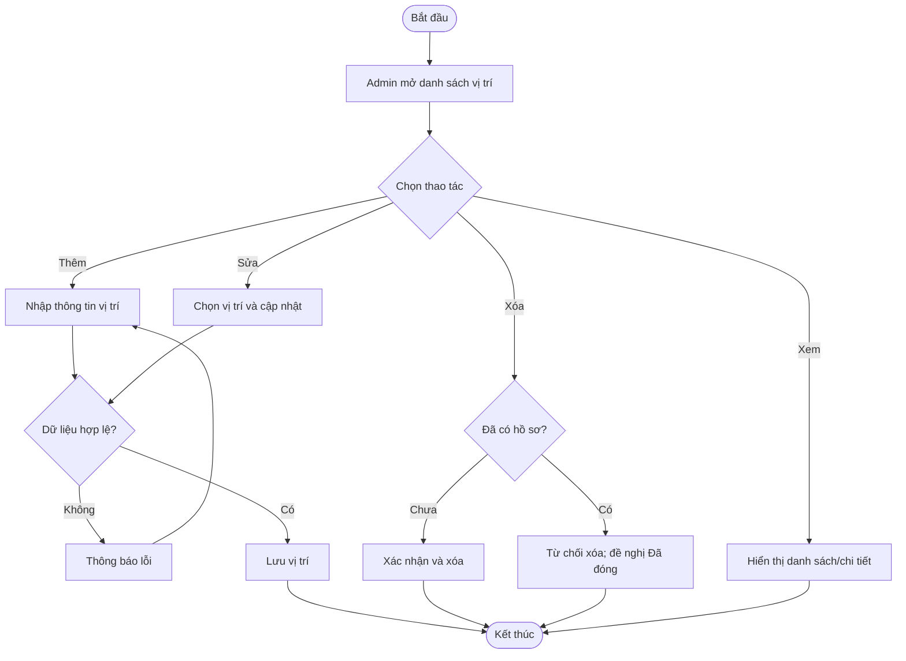
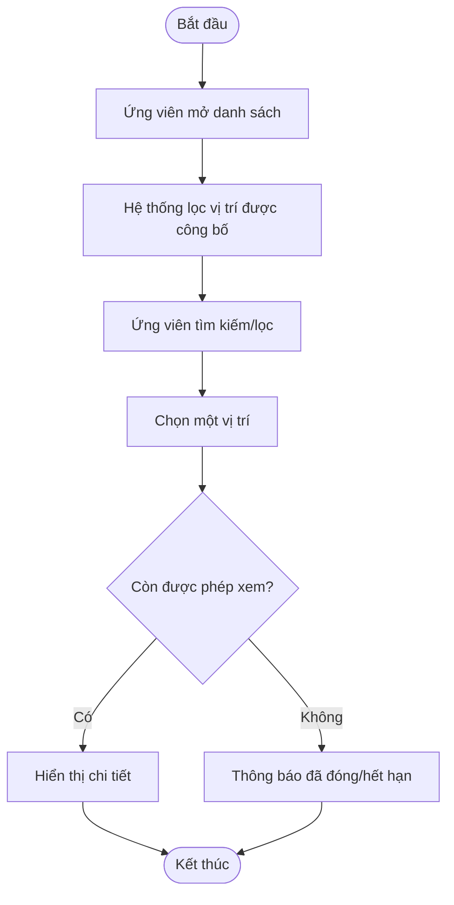
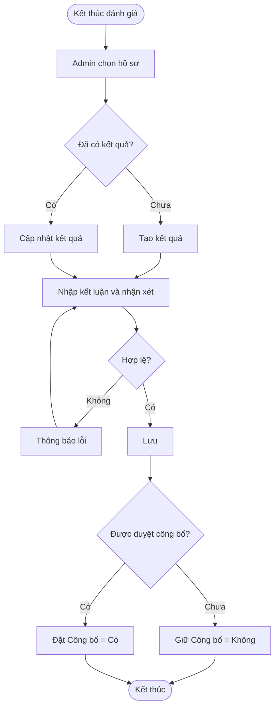
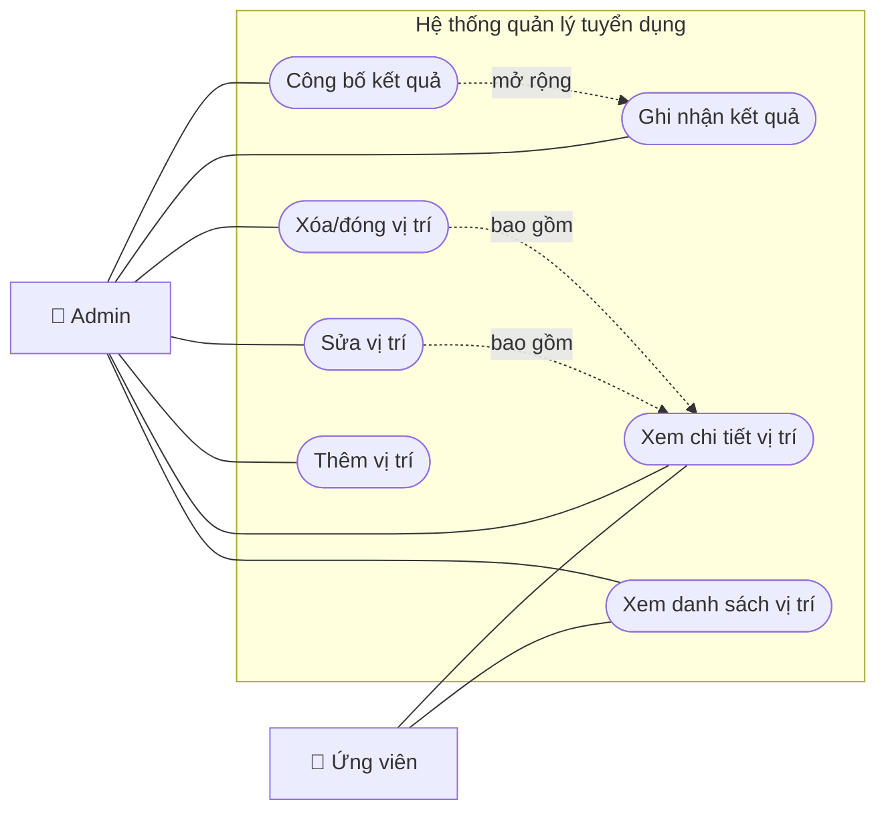
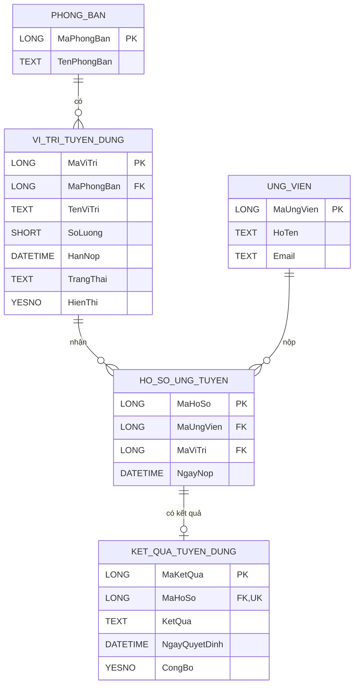

# PHÂN TÍCH VÀ THIẾT KẾ PHÂN HỆ VỊ TRÍ – KẾT QUẢ TUYỂN DỤNG

## 0. Thông tin và phạm vi

- **Đề tài:** Phân tích và thiết kế hệ thống quản lý tuyển dụng.
- **Phân hệ thực hiện:** Quản lý vị trí tuyển dụng và dữ liệu kết quả tuyển dụng.
- **Mô hình triển khai:** Microsoft Access, chạy trên một máy tính.
- **Giao diện PHP:** prototype minh họa màn hình và thao tác.
- **Tác nhân chính:** Quản trị viên tuyển dụng (Admin) và Ứng viên.

Phần này giải quyết hai bài toán:

1. Admin quản lý vòng đời vị trí tuyển dụng: xem, thêm, sửa, xóa hoặc đóng vị trí.
2. Ứng viên tra cứu danh sách, xem chi tiết vị trí được công bố; hệ thống lưu kết quả cuối cùng theo từng hồ sơ ứng tuyển.

---

## 1. Khảo sát hiện trạng

### 1.1. Mục tiêu khảo sát

- Xác định ai tạo và cập nhật thông tin tuyển dụng.
- Xác định dữ liệu cần lưu cho một vị trí và một kết quả.
- Tìm bất cập khi quản lý bằng giấy, Word hoặc Excel rời rạc.
- Xác định luồng từ lúc phát sinh nhu cầu đến lúc có kết quả.
- Xác định quyền của Admin và Ứng viên.

### 1.2. Đối tượng và phương pháp khảo sát

| Đối tượng/nguồn | Phương pháp | Nội dung thu thập |
|---|---|---|
| Nhân viên tuyển dụng/Admin | Phỏng vấn | Cách tạo tin, cập nhật, đóng vị trí và thông báo kết quả |
| Trưởng bộ phận | Phỏng vấn | Tên vị trí, số lượng, yêu cầu, hạn tuyển |
| Ứng viên | Quan sát/phỏng vấn ngắn | Cách tìm và đọc thông tin vị trí |
| File Excel, tin tuyển dụng, email | Nghiên cứu tài liệu | Trường dữ liệu và mẫu báo cáo hiện có |
| Quy trình nội bộ | Quan sát | Các bước và người chịu trách nhiệm |

Kết quả dưới đây là giả định hợp lý cho một đơn vị quy mô nhỏ. Khi triển khai thực tế phải xác nhận lại với đơn vị sử dụng.

### 1.3. Câu hỏi và kết quả khảo sát giả định

| STT | Câu hỏi | Kết quả tổng hợp |
|---:|---|---|
| 1 | Ai được tạo vị trí tuyển dụng? | Nhân viên tuyển dụng có quyền Admin |
| 2 | Một vị trí cần thông tin nào? | Tên, phòng ban, số lượng, mô tả, yêu cầu, quyền lợi, địa điểm, hình thức, mức lương, ngày đăng, hạn nộp, trạng thái |
| 3 | Trạng thái vị trí gồm gì? | Nháp, Đang tuyển, Tạm dừng, Đã đóng |
| 4 | Ứng viên được xem vị trí nào? | Chỉ vị trí bật hiển thị, đang tuyển và còn hạn |
| 5 | Có được sửa sau khi có ứng viên? | Có, nhưng không làm thay đổi lịch sử hồ sơ |
| 6 | Khi nào được xóa vị trí? | Chỉ khi chưa có hồ sơ; nếu đã có thì chuyển Đã đóng |
| 7 | Một ứng viên có thể ứng tuyển nhiều vị trí? | Có |
| 8 | Một hồ sơ có bao nhiêu kết quả cuối? | Tối đa một |
| 9 | Các mức kết quả? | Chờ quyết định, Đạt, Không đạt, Dự bị |
| 10 | Khi nào ứng viên xem được kết quả? | Khi Admin đánh dấu công bố |
| 11 | Cần tra cứu gì thường xuyên? | Vị trí đang tuyển, sắp hết hạn, số hồ sơ, danh sách kết quả |
| 12 | Hệ thống dùng ở đâu? | Một máy nội bộ, dữ liệu trong một tệp Access |

### 1.4. Quy trình hiện tại (AS-IS)

1. Trưởng bộ phận gửi nhu cầu tuyển qua giấy, email hoặc tin nhắn.
2. Nhân viên tuyển dụng nhập lại vào Word/Excel và đăng tin.
3. Khi nội dung hoặc hạn nộp đổi, nhiều bản được sửa thủ công.
4. Ứng viên có thể gặp tin hết hạn nhưng chưa được gỡ.
5. Kết quả phỏng vấn được ghi ở file khác hoặc trao đổi qua email.
6. Nhân viên tuyển dụng dò tên và vị trí để tổng hợp kết quả.

### 1.5. Hạn chế

- Dữ liệu vị trí trùng hoặc không đồng nhất giữa các file.
- Khó xác định bản thông tin mới nhất.
- Tin hết hạn có thể vẫn hiển thị.
- Kết quả dễ gắn nhầm khi một ứng viên ứng tuyển nhiều vị trí.
- Xóa nhầm vị trí làm mất ngữ cảnh hồ sơ và kết quả.
- Tổng hợp số lượng và kết quả mất thời gian.

### 1.6. Quy trình đề xuất (TO-BE)

1. Admin tiếp nhận nhu cầu và tạo vị trí ở trạng thái **Nháp**.
2. Admin kiểm tra rồi chuyển sang **Đang tuyển**, bật **Hiển thị**.
3. Ứng viên xem danh sách và chi tiết các vị trí được công bố.
4. Hồ sơ được gắn với đúng ứng viên và đúng vị trí.
5. Sau đánh giá/phỏng vấn, Admin ghi một kết quả cho hồ sơ.
6. Admin kiểm tra và bật **Công bố** để ứng viên được xem.
7. Hết hạn hoặc đủ người, Admin chuyển vị trí sang **Đã đóng**; lịch sử vẫn giữ.

---

## 2. Yêu cầu hệ thống

### 2.1. Yêu cầu chức năng

| Mã | Yêu cầu |
|---|---|
| FR-01 | Admin xem, tìm kiếm và lọc danh sách vị trí |
| FR-02 | Admin xem chi tiết vị trí |
| FR-03 | Admin thêm vị trí |
| FR-04 | Admin sửa vị trí |
| FR-05 | Admin xóa vị trí chưa phát sinh hồ sơ |
| FR-06 | Admin đóng/tạm dừng vị trí cần giữ lịch sử |
| FR-07 | Ứng viên xem danh sách vị trí được công bố, đang tuyển và còn hạn |
| FR-08 | Ứng viên xem chi tiết vị trí được phép hiển thị |
| FR-09 | Admin ghi và cập nhật kết quả theo hồ sơ |
| FR-10 | Admin công bố hoặc ẩn kết quả |
| FR-11 | Tra cứu kết quả theo ứng viên, vị trí, trạng thái |
| FR-12 | Thống kê số hồ sơ và kết quả theo vị trí |

### 2.2. Yêu cầu phi chức năng

| Mã | Yêu cầu |
|---|---|
| NFR-01 | Chạy trên một máy có Microsoft Access |
| NFR-02 | Phản hồi thao tác cơ bản trong khoảng 2 giây ở quy mô bài tập |
| NFR-03 | Giao diện, Caption và thông báo bằng tiếng Việt |
| NFR-04 | Kiểm tra trường bắt buộc, ngày và số lượng trước khi lưu |
| NFR-05 | Sao lưu bằng cách đóng ứng dụng và chép tệp `.accdb` |
| NFR-06 | Admin được cập nhật; ứng viên chỉ xem dữ liệu công khai |
| NFR-07 | Không xóa dây chuyền dữ liệu lịch sử |

### 2.3. Phạm vi

**Trong phạm vi:** quản lý và xem vị trí, lưu/công bố kết quả, truy vấn và báo cáo đơn giản.

**Ngoài phạm vi:** website tuyển dụng quy mô lớn, email/SMS thật, tích hợp mạng xã hội, phân quyền phức tạp, nhiều người dùng đồng thời và bảo mật web nâng cao.

---

## 3. Quy trình nghiệp vụ

### 3.1. Admin quản lý vị trí



Điểm kiểm soát: tên và phòng ban phải có; số lượng lớn hơn 0; hạn nộp không trước ngày đăng; trạng thái thuộc danh mục.

### 3.2. Ứng viên xem vị trí



### 3.3. Ghi nhận và công bố kết quả



### 3.4. Vòng đời trạng thái

```text
Vị trí: Nháp -> Đang tuyển -> Tạm dừng -> Đang tuyển
                             \-> Đã đóng
        Nháp -------------------> Đã đóng

Kết quả: Chờ quyết định -> Đạt / Không đạt / Dự bị
         Dự bị -> Đạt / Không đạt
```

---

## 4. Quy tắc nghiệp vụ

| Mã | Quy tắc |
|---|---|
| BR-01 | Mỗi vị trí có mã tự tăng duy nhất |
| BR-02 | Tên vị trí, phòng ban, số lượng, ngày đăng, trạng thái là bắt buộc |
| BR-03 | Số lượng tuyển là số nguyên lớn hơn 0 |
| BR-04 | Hạn nộp bằng hoặc sau ngày đăng |
| BR-05 | Ứng viên thấy vị trí khi `HienThi = Có`, trạng thái `Đang tuyển`, chưa quá hạn |
| BR-06 | Vị trí đã có hồ sơ không được xóa vật lý |
| BR-07 | Tắt hiển thị không làm mất vị trí hoặc hồ sơ |
| BR-08 | Một ứng viên có thể có nhiều hồ sơ |
| BR-09 | Mỗi hồ sơ thuộc đúng một vị trí |
| BR-10 | Mỗi hồ sơ có tối đa một kết quả |
| BR-11 | Kết quả thuộc: Chờ quyết định, Đạt, Không đạt, Dự bị |
| BR-12 | Kết quả khác Chờ quyết định phải có ngày quyết định |
| BR-13 | Kết quả chỉ hiện cho ứng viên khi `CongBo = Có` |
| BR-14 | Không xóa dây chuyền từ vị trí xuống hồ sơ và kết quả |
| BR-15 | Nếu có lương từ và đến thì lương đến không nhỏ hơn lương từ |

---

## 5. Use Case

### 5.1. Sơ đồ tổng quát



### 5.2. Danh sách Use Case

| Mã | Tên | Tác nhân | Kết quả |
|---|---|---|---|
| UC-VT-01 | Xem danh sách vị trí | Admin, Ứng viên | Danh sách đúng theo quyền |
| UC-VT-02 | Xem chi tiết vị trí | Admin, Ứng viên | Chi tiết được phép xem |
| UC-VT-03 | Thêm vị trí | Admin | Tạo vị trí hợp lệ |
| UC-VT-04 | Sửa vị trí | Admin | Cập nhật, giữ nguyên mã |
| UC-VT-05 | Xóa/đóng vị trí | Admin | Xóa an toàn hoặc đóng để giữ lịch sử |
| UC-KQ-01 | Ghi nhận kết quả | Admin | Một hồ sơ tối đa một kết quả |
| UC-KQ-02 | Công bố kết quả | Admin | Cho phép ứng viên xem |

### 5.3. UC-VT-01 – Xem danh sách vị trí

| Thuộc tính | Nội dung |
|---|---|
| Tác nhân | Admin, Ứng viên |
| Tiền điều kiện | Hệ thống và tệp CSDL hoạt động |
| Kích hoạt | Chọn mục Vị trí tuyển dụng |
| Luồng chính | (1) Đọc dữ liệu. (2) Admin thấy mọi trạng thái; Ứng viên chỉ thấy dữ liệu theo BR-05. (3) Tác nhân tìm kiếm/lọc. (4) Trả danh sách phù hợp. |
| Thay thế | Không có dữ liệu: hiển thị danh sách rỗng và thông báo |
| Hậu điều kiện | Không thay đổi dữ liệu |

### 5.4. UC-VT-02 – Xem chi tiết vị trí

| Thuộc tính | Nội dung |
|---|---|
| Tác nhân | Admin, Ứng viên |
| Tiền điều kiện | Vị trí tồn tại; với Ứng viên phải thỏa BR-05 |
| Kích hoạt | Chọn một vị trí |
| Luồng chính | (1) Nhận mã. (2) Kiểm tra tồn tại và quyền xem. (3) Hiển thị tên, phòng ban, số lượng, mô tả, yêu cầu, quyền lợi, địa điểm, hình thức, mức lương, hạn nộp. |
| Ngoại lệ | Không tìm thấy hoặc hết quyền xem: thông báo không còn khả dụng |
| Hậu điều kiện | Không thay đổi dữ liệu |

### 5.5. UC-VT-03 – Thêm vị trí

| Thuộc tính | Nội dung |
|---|---|
| Tác nhân | Admin |
| Tiền điều kiện | Admin đã xác thực |
| Kích hoạt | Chọn Thêm vị trí |
| Luồng chính | (1) Mở biểu mẫu. (2) Nhập dữ liệu. (3) Chọn Lưu. (4) Kiểm tra BR-02, 03, 04, 15. (5) Sinh mã và lưu. (6) Báo thành công. |
| Thay thế | Dữ liệu sai/thiếu: đánh dấu lỗi, không lưu, cho nhập lại |
| Hậu điều kiện | Có thêm bản ghi hợp lệ |

### 5.6. UC-VT-04 – Sửa vị trí

| Thuộc tính | Nội dung |
|---|---|
| Tác nhân | Admin |
| Tiền điều kiện | Vị trí tồn tại; Admin đã xác thực |
| Kích hoạt | Chọn Sửa |
| Luồng chính | (1) Nạp dữ liệu. (2) Thay đổi. (3) Kiểm tra. (4) Cập nhật `NgayCapNhat`. (5) Lưu và thông báo. |
| Ngoại lệ | Không tồn tại hoặc dữ liệu sai: không cập nhật, báo lý do |
| Hậu điều kiện | Mã không đổi, thông tin mới được lưu |

### 5.7. UC-VT-05 – Xóa/đóng vị trí

| Thuộc tính | Nội dung |
|---|---|
| Tác nhân | Admin |
| Tiền điều kiện | Vị trí tồn tại; Admin đã xác thực |
| Kích hoạt | Chọn Xóa |
| Luồng chính | (1) Yêu cầu xác nhận. (2) Admin xác nhận. (3) Kiểm tra hồ sơ. (4) Nếu chưa có hồ sơ thì xóa. (5) Báo thành công. |
| Thay thế | Đã có hồ sơ: từ chối xóa, đề nghị đặt `Đã đóng`, `HienThi = Không`. |
| Hậu điều kiện | Xóa an toàn hoặc giữ lịch sử |

### 5.8. UC-KQ-01 – Ghi nhận kết quả

| Thuộc tính | Nội dung |
|---|---|
| Tác nhân | Admin |
| Tiền điều kiện | Hồ sơ tồn tại; Admin đã xác thực |
| Kích hoạt | Chọn Ghi kết quả tại hồ sơ |
| Luồng chính | (1) Nạp ứng viên, vị trí từ hồ sơ. (2) Chọn kết quả, nhập nhận xét. (3) Kiểm tra BR-10, 11, 12. (4) Lưu mới hoặc cập nhật. |
| Ngoại lệ | Hồ sơ không tồn tại hoặc dữ liệu sai: không lưu, báo lỗi |
| Hậu điều kiện | Hồ sơ có tối đa một kết quả, mặc định chưa công bố |

### 5.9. UC-KQ-02 – Công bố kết quả

| Thuộc tính | Nội dung |
|---|---|
| Tác nhân | Admin |
| Tiền điều kiện | Kết quả đã được ghi và kiểm tra |
| Kích hoạt | Chọn Công bố |
| Luồng chính | (1) Hiển thị nội dung. (2) Admin xác nhận. (3) Đặt `CongBo = Có`. (4) Đúng ứng viên được phép xem. |
| Thay thế | Admin hủy: giữ `CongBo = Không` |
| Hậu điều kiện | Trạng thái công bố được lưu |

---

## 6. ERD và chuẩn hóa



### 6.1. Quan hệ

- **Phòng ban 1–N Vị trí:** một phòng ban có nhiều vị trí; mỗi vị trí thuộc một phòng ban.
- **Vị trí 1–N Hồ sơ:** một vị trí nhận nhiều hồ sơ; mỗi hồ sơ ứng tuyển một vị trí.
- **Ứng viên 1–N Hồ sơ:** một ứng viên có thể nộp nhiều hồ sơ.
- **Hồ sơ 1–0..1 Kết quả:** hồ sơ đang xử lý chưa có kết quả; khi có chỉ có một kết quả cuối.

### 6.2. Vì sao Kết quả liên kết với Hồ sơ?

Nếu `KetQuaTuyenDung` chỉ chứa `MaUngVien`, hệ thống không biết kết quả thuộc lần ứng tuyển nào khi một người ứng tuyển nhiều vị trí. `MaHoSo` xác định đồng thời ứng viên, vị trí và lần nộp, tránh lặp `MaUngVien`, `MaViTri` trong bảng kết quả.

### 6.3. Chuẩn hóa

- Trường chứa giá trị đơn: đạt 1NF.
- Thuộc tính phụ thuộc đầy đủ vào khóa chính một trường: đạt 2NF.
- Tên phòng ban không lặp trong vị trí; tên ứng viên và tên vị trí không lặp trong kết quả: phù hợp 3NF.

---

## 7. Thiết kế bảng Access

Tên vật lý dùng chữ không dấu để dễ viết query. Có thể đặt thuộc tính **Caption** bằng tiếng Việt.

### 7.1. `ViTriTuyenDung`

| Trường | Kiểu Access | Bắt buộc | Khóa/chỉ mục | Mặc định/kiểm tra | Ý nghĩa |
|---|---|---:|---|---|---|
| MaViTri | AutoNumber | Có | PK, unique | Tự tăng | Mã vị trí |
| MaPhongBan | Number - Long Integer | Có | FK, duplicates OK | Phải tồn tại | Phòng ban tuyển |
| TenViTri | Short Text (150) | Có | duplicates OK | Không rỗng | Tên vị trí |
| SoLuong | Number - Integer | Có |  | Default 1; `>0` | Số cần tuyển |
| MoTaCongViec | Long Text | Không |  |  | Mô tả công việc |
| YeuCau | Long Text | Không |  |  | Yêu cầu ứng viên |
| QuyenLoi | Long Text | Không |  |  | Quyền lợi |
| DiaDiem | Short Text (150) | Không |  |  | Nơi làm việc |
| HinhThucLamViec | Short Text (30) | Không |  |  | Toàn thời gian... |
| LuongTu | Currency | Không |  | `Is Null Or >=0` | Lương thấp nhất |
| LuongDen | Currency | Không |  | Không nhỏ hơn LuongTu | Lương cao nhất |
| ThoaThuanLuong | Yes/No | Có |  | No | Có thỏa thuận lương |
| NgayDang | Date/Time | Có |  | `Date()` | Ngày đăng |
| HanNop | Date/Time | Không | Indexed OK | Không trước NgayDang | Hạn nhận hồ sơ |
| TrangThai | Short Text (20) | Có | duplicates OK | Nháp; thuộc 4 trạng thái | Vòng đời vị trí |
| HienThi | Yes/No | Có |  | No | Cho ứng viên xem |
| NgayTao | Date/Time | Có |  | `Now()` | Thời điểm tạo |
| NgayCapNhat | Date/Time | Không |  |  | Lần sửa cuối |

Khóa ngoại `MaPhongBan` tham chiếu `PhongBan.MaPhongBan`. Không bật Cascade Delete.

### 7.2. `KetQuaTuyenDung`

| Trường | Kiểu Access | Bắt buộc | Khóa/chỉ mục | Mặc định/kiểm tra | Ý nghĩa |
|---|---|---:|---|---|---|
| MaKetQua | AutoNumber | Có | PK, unique | Tự tăng | Mã kết quả |
| MaHoSo | Number - Long Integer | Có | FK, **unique** | Phải tồn tại | Hồ sơ được kết luận |
| KetQua | Short Text (20) | Có | duplicates OK | Chờ quyết định; thuộc danh mục | Kết luận |
| NgayQuyetDinh | Date/Time | Điều kiện |  | Bắt buộc nếu đã kết luận | Ngày quyết định |
| NhanXet | Long Text | Không |  |  | Nhận xét tổng hợp |
| LuongDeXuat | Currency | Không |  | `Is Null Or >=0` | Lương đề xuất |
| NgayNhanViecDuKien | Date/Time | Không |  | Không trước ngày quyết định | Ngày dự kiến nhận việc |
| TrangThaiPhanHoi | Short Text (30) | Có | duplicates OK | Chưa gửi | Phản hồi offer |
| NguoiDuyet | Short Text (100) | Không |  |  | Người duyệt ở mô hình một máy |
| CongBo | Yes/No | Có |  | No | Cho ứng viên xem |
| NgayTao | Date/Time | Có |  | `Now()` | Thời điểm tạo |
| NgayCapNhat | Date/Time | Không |  |  | Lần sửa cuối |

Khóa ngoại `MaHoSo` tham chiếu `HoSoUngTuyen.MaHoSo`. Chỉ mục unique thực thi quy tắc một hồ sơ tối đa một kết quả.

### 7.3. Bảng tối thiểu để kiểm thử quan hệ

| Bảng | Vai trò | PK | FK |
|---|---|---|---|
| PhongBan | Danh mục phòng ban | MaPhongBan |  |
| UngVien | Người ứng tuyển | MaUngVien |  |
| HoSoUngTuyen | Liên kết ứng viên–vị trí | MaHoSo | MaUngVien, MaViTri |

Khi ghép bài nhóm có thể ánh xạ sang bảng tương ứng của thành viên khác, nhưng giữ lực lượng quan hệ 1–N và 1–0..1.

### 7.4. Tạo quan hệ trong Access

Trong **Database Tools > Relationships**:

1. `PhongBan.MaPhongBan` → `ViTriTuyenDung.MaPhongBan`.
2. `ViTriTuyenDung.MaViTri` → `HoSoUngTuyen.MaViTri`.
3. `UngVien.MaUngVien` → `HoSoUngTuyen.MaUngVien`.
4. `HoSoUngTuyen.MaHoSo` → `KetQuaTuyenDung.MaHoSo`.

Chọn **Enforce Referential Integrity** và **Cascade Update Related Fields**; không chọn **Cascade Delete Related Records**.

---

## 8. Query, Form và Report đề xuất

### 8.1. Query

| Query | Mục đích |
|---|---|
| Q_ViTriDangTuyen | Danh sách ứng viên được phép xem |
| Q_ChiTietViTri | Chi tiết theo mã |
| Q_ViTriSapHetHan | Vị trí còn tối đa 7 ngày |
| Q_KetQuaChiTiet | Ghép kết quả với hồ sơ, ứng viên, vị trí |
| Q_ThongKeTheoViTri | Đếm hồ sơ và các mức kết quả |

### 8.2. Form

- `F_ViTriDanhSach`: danh sách, tìm, lọc, thêm/sửa/xóa.
- `F_ViTriChiTiet`: biểu mẫu nhập; Combo Box cho phòng ban và trạng thái.
- `F_UngVien_XemViTri`: chỉ đọc, dựa trên `Q_ViTriDangTuyen`.
- `F_KetQua`: chọn hồ sơ, ghi kết quả, nhận xét, công bố.

### 8.3. Report

- `R_ViTriDangTuyen`: danh sách còn tuyển.
- `R_KetQuaTheoViTri`: ứng viên và kết quả nhóm theo vị trí.
- `R_ThongKeTuyenDung`: số hồ sơ, số đạt và tỷ lệ đạt.

---

## 9. Kiểm thử chấp nhận

| Mã | Tình huống | Dữ liệu/thao tác | Kết quả mong đợi |
|---|---|---|---|
| TC-01 | Thêm hợp lệ | Số lượng 2, hạn sau ngày đăng | Lưu, tự sinh mã |
| TC-02 | Thiếu tên | TenViTri rỗng | Không lưu |
| TC-03 | Sai số lượng | SoLuong = 0 | Không lưu |
| TC-04 | Sai hạn | HanNop trước NgayDang | Không lưu |
| TC-05 | Ứng viên xem | Có Nháp và Đang tuyển | Chỉ bản ghi thỏa BR-05 |
| TC-06 | Xóa chưa có hồ sơ | Xác nhận | Xóa thành công |
| TC-07 | Xóa đã có hồ sơ | Xác nhận | Bị chặn; giữ dữ liệu |
| TC-08 | Tạo kết quả đầu | MaHoSo chưa có kết quả | Lưu thành công |
| TC-09 | Tạo kết quả thứ hai | Lặp MaHoSo | Bị unique index chặn |
| TC-10 | Kết luận thiếu ngày | Đạt, ngày rỗng | Không lưu |
| TC-11 | Chưa công bố | CongBo = No | Ứng viên không thấy |
| TC-12 | Công bố | CongBo = Yes | Đúng ứng viên xem được |

---

## 10. Kịch bản trình bày ngắn

> Em phụ trách quản lý vị trí và bảng kết quả tuyển dụng. Khảo sát giả định cho thấy dữ liệu thường nằm rời rạc trong Excel, Word và email nên dễ trùng, khó kiểm soát hạn tuyển và có thể gắn nhầm kết quả khi một ứng viên ứng tuyển nhiều vị trí.
>
> Hệ thống có hai tác nhân. Admin xem, thêm, sửa, xóa hoặc đóng vị trí và ghi, công bố kết quả. Ứng viên chỉ xem các vị trí đang tuyển, còn hạn và được bật hiển thị.
>
> Điểm quan trọng trong ERD là bảng Kết quả liên kết với Hồ sơ ứng tuyển chứ không liên kết thẳng với Ứng viên. Hồ sơ xác định đúng ứng viên, vị trí và lần ứng tuyển. Chỉ mục duy nhất ở MaHoSo bảo đảm một hồ sơ chỉ có tối đa một kết quả.
>
> Khi xóa, hệ thống chỉ xóa vị trí chưa có hồ sơ. Nếu đã có dữ liệu thì chuyển Đã đóng để giữ lịch sử và toàn vẹn tham chiếu. Mô hình chạy trên một máy bằng Access; PHP chỉ minh họa nên không triển khai như môn Lập trình Web.

### Câu hỏi phản biện thường gặp

**Vì sao không lưu tên ứng viên và tên vị trí trong bảng kết quả?**  
Vì sẽ lặp và dễ lệch dữ liệu. Từ `MaHoSo` nối ra được cả ứng viên và vị trí.

**Vì sao hồ sơ có 0 hoặc 1 kết quả?**  
Hồ sơ đang xử lý chưa có kết quả; sau quyết định chỉ cần một kết quả cuối. Unique index trên `MaHoSo` bảo đảm điều này.

**Có chức năng xóa nhưng sao đôi khi không xóa được?**  
Xóa chỉ hợp lệ khi chưa có hồ sơ. Có lịch sử thì đóng vị trí là đúng nghiệp vụ và tránh mất liên kết.

**Vì sao có cả TrangThai và HienThi?**  
`TrangThai` mô tả vòng đời; `HienThi` là quyết định công bố. Có thể ẩn tạm mà không làm thay đổi dữ liệu nghiệp vụ.

**Vì sao chọn Access?**  
Quy mô nhỏ, một máy, dễ tạo bảng, quan hệ, query, form và report; không cần máy chủ CSDL.

---

## 11. Đối chiếu prototype PHP

| Prototype | Thành phần phân tích |
|---|---|
| `pages/vi-tri.php` | UC-VT-01, 03, 04, 05 |
| `pages/ket-qua.php` | UC-KQ-01, 02 và Q_KetQuaChiTiet |
| `config/database.php` | Dữ liệu giả giao diện, không phải thiết kế chính thức |
| `database/database.sql` | MySQL minh họa ban đầu; `database/access` là thiết kế phần này |

Không cần bổ sung kiến trúc web phức tạp. Khi demo, dùng PHP để chỉ màn hình và Access để trình bày bảng, quan hệ, query, dữ liệu mẫu.
